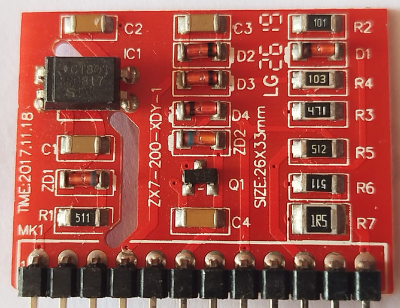
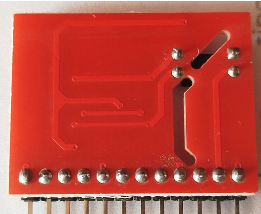
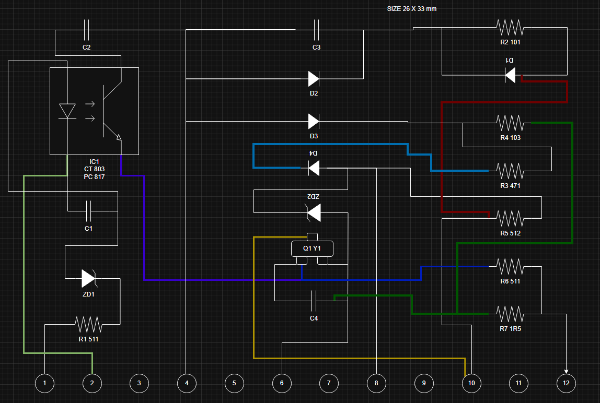

# TIME-2017.11.18-tarjeta-soldador-furius-xt201
informacion tecnica de la tarjeta para maquina de soldar

Referencia: FW201-06B
Descripcion: REPUES FW201 TARJETA DE EXCITACIÓN DE TRANSFORMADOR
Largo: 32.9 mm
Ancho: 25.7 mm
Espesor: 1.4 mm

optoacoplador: ct803 pc817
- 4.49 1.14
- 2.18 vf, ir 10.0uA

zd1: 0.80 vf
zd2: 0.80 vf
zd4: 0.72 vf
Q1: 0.77 - 2.08 : Y1
